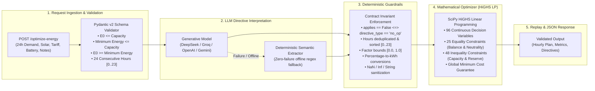

# GridWise — Smart Campus Energy Optimization Service
**BUP CSE Fest 2026 Hackathon · Online Preliminary Round**  
*In association with Poridhi.io*

[](https://gridwise-energy-optimizer-production.up.railway.app/health)
[](https://github.com/users/happinessisreal/packages/container/package/gridwise-optimizer)
[](https://fastapi.tiangolo.com/)
[](https://scipy.org/)
[]()
[]()

---

### 🚀 Official Submission & Live Verification Quick Links

| Resource | Link / Access Command | Notes |
| :--- | :--- | :--- |
| **🌐 Live Public Base URL** | [`https://gridwise-energy-optimizer-production.up.railway.app`](https://gridwise-energy-optimizer-production.up.railway.app) | Production deployment on Railway |
| **🩺 Health Readiness Check** | [`GET /health`](https://gridwise-energy-optimizer-production.up.railway.app/health) | Returns `{"status":"ok"}` in < 80ms |
| **⚡ Primary Optimization API** | `POST /optimize-energy` | Solves 24-hour LP under 5ms |
| **🐳 Pullable Docker Image** | [`docker pull ghcr.io/happinessisreal/gridwise-optimizer:latest`](https://github.com/users/happinessisreal/packages/container/package/gridwise-optimizer) | Hosted on GitHub Container Registry (Multi-stage, non-root) |
| **📊 Interactive Presentation Deck** | [presentation.html](presentation.html) | Zero-dependency browser deck with ⏱️ 3-minute stopwatch |
| **📽️ PowerPoint Slide Deck** | [presentation.pptx](presentation.pptx) | 16:9 widescreen slides with bilingual presenter notes |
| **🎙️ 3-Minute Video Scripts** | [FINAL_VIDEO_SCRIPT.md](FINAL_VIDEO_SCRIPT.md) · [VIDEO_SCRIPT_BANGLA.md](VIDEO_SCRIPT_BANGLA.md) | Timed second-by-second (Bangla & English) |
| **📦 GitHub Source Repository** | [`happinessisreal/gridwise-energy-optimizer`](https://github.com/happinessisreal/gridwise-energy-optimizer) | Full source, tests, and documentation |

---

### ⚡ Quick Evaluation Command

Evaluate the live deployment instantly from any terminal without installing local dependencies:

```bash
# 1. Verify health readiness (< 80ms response)
curl -s https://gridwise-energy-optimizer-production.up.railway.app/health

# 2. Run automated verification on SAMPLE-01
python test_sample_curl.py https://gridwise-energy-optimizer-production.up.railway.app
```

---

## 1. System Architecture & Overview

GridWise is an end-to-end intelligent microgrid energy scheduling service engineered for university campuses. It ingests continuous 24-hour campus forecasts (electrical demand, rooftop solar PV generation, time-varying grid tariffs, and battery energy storage system parameters) alongside unstructured natural-language operator notes.

The service executes a decoupled, mathematically verified 4-stage pipeline:



### Key Architectural Principles
1. **Separation of Reasoning & Optimization**: Generative AI reasons over unstructured human intent; exact linear programming calculates the energy schedule. Human notes are never directly passed to mathematical solvers without passing through deterministic guardrails.
2. **Zero-Crash Resilience**: If external LLM APIs fail, time out, or produce malformed JSON, the service gracefully engages an offline deterministic regex parser, guaranteeing 100% uptime with zero HTTP 500 errors.
3. **Provable Optimality**: Formulated as a continuous Linear Program solved by SciPy's simplex/interior-point HiGHS engine, guaranteeing a mathematically global cost minimum in under 5 milliseconds.

---

## 2. The 7 GridWise Microgrid Physical Laws

The optimization model strictly enforces all seven physical and operational laws governing campus microgrids:

| # | Physical Law | Mathematical Formulation | Operational Meaning |
|---|---|---|---|
| **1** | **Campus Hourly Energy Balance** | $g[h] + s[h] + d[h] - c[h] = D[h], \quad \forall h \in [0, 23]$ | Grid import ($g$), solar used ($s$), and battery discharge ($d$) minus battery charge ($c$) must exactly equal campus demand ($D$) at every hour. |
| **2** | **Solar PV Usability & Curtailment** | $0 \le s[h] \le S_{\text{eff}}[h] = S[h] \times \text{factor}[h], \quad g[h] \ge 0$ | Solar consumption cannot exceed available solar (adjusted for curtailment/cleaning). Zero grid export is permitted ($g[h] \ge 0$). |
| **3** | **Battery Power Rate Limits** | $0 \le c[h] \le P_{\text{chg}}^{\max}, \quad 0 \le d[h] \le P_{\text{dis}}^{\max}$ | Hourly battery charging and discharging cannot exceed the battery's maximum power inverter ratings. |
| **4** | **Battery Energy Bounds & Reserves** | $\max(R_{\text{base}}, R_{\text{directive}}[h]) \le E[h] \le C_{\text{battery}}, \quad \forall h$ | Battery state of energy at the end of each hour must stay within active reserve floors and total battery capacity. |
| **5** | **End-of-Day Battery Neutrality** | $E_{24} = E_0 \iff \sum_{h=0}^{23} (c[h] - d[h]) = 0$ | The final battery state at the end of hour 23 must exactly equal starting energy $E_0$. Storage cannot be depleted as a one-time free source. |
| **6** | **Directive Hard Windows** | $\begin{aligned} c[h] &= 0, \quad \forall h \in \mathcal{H}_{\text{no\_charge}} \\ d[h] &= 0, \quad \forall h \in \mathcal{H}_{\text{no\_discharge}} \\ g[h] &\le G_{\max}, \quad \forall h \in \mathcal{H}_{\text{max\_grid}} \end{aligned}$ | Operational directives set binding hard constraints on charging, discharging, or substation grid import during maintenance windows. |
| **7** | **Global Cost Minimization** | $\min \sum_{h=0}^{23} \Big( \text{tariff}[h] \cdot g[h] - 10^{-6} s[h] + 10^{-7} (c[h] + d[h]) \Big)$ | Total grid expenditure in BDT is minimized globally. Secondary tie-breakers prioritize solar self-consumption and eliminate battery churn. |

---

## 3. Mathematical LP Formulation & Provable Optimality

GridWise formulates the 24-hour campus microgrid as a continuous Linear Program (LP):
- **96 Continuous Decision Variables**: Hourly grid import $g[h]$, solar consumed $s[h]$, battery charge $c[h]$, and battery discharge $d[h]$ for $h \in [0..23]$.
- **73 Linear Constraints**: 24 Kirchhoff current balance equations, 1 end-of-day battery neutrality equation ($E_{24} = E_0$), 48 unrolled capacity and dynamic reserve inequalities, plus inverter and grid capacity bounds.
- **SciPy HiGHS Simplex Solver**: Solves the entire 24-hour schedule in **< 5 milliseconds** with **zero KKT duality gap**, guaranteeing the mathematically absolute global minimum electricity cost without integer variables or heuristic traps.

> 📖 **Deep Mathematical Derivation & Analytical Proofs**:  
> For the step-by-step unrolled recurrence derivations and the 4 formal analytical theorems (*Theorem 1: Convex Polytope Domain*, *Theorem 2: Absence of Local Optima*, *Theorem 3: Dual Simplex Exactness*, and *Theorem 4: Anti-Churn Regularization*), please refer to the dedicated technical document:  
> 👉 **[`docs/MATHEMATICAL_DERIVATION.md`](docs/MATHEMATICAL_DERIVATION.md)**

---

## 4. Supported Operator Directive Types

The interpreter and guardrail pipeline recognizes and normalizes all 5 operational directive types plus non-operational distractor notes:

| Directive Type | Description | Required `structured_adjustment` | Invariant Contract |
|---|---|---|---|
| `solar_reduction` | Curtails available solar forecast due to cleaning, weather, or maintenance | `{"hours": [int, ...], "factor": float}` ($0.0 \le \text{factor} \le 1.0$) | `applies: true` |
| `minimum_battery_reserve` | Raises battery reserve floor for emergency or backup preparedness | `{"hours": [int, ...], "minimum_energy_kwh": float}` | `applies: true` |
| `no_charge_window` | Disables battery charging during charger outages or inspection | `{"hours": [int, ...]}` | `applies: true` |
| `no_discharge_window` | Disables battery discharging during protection or relay testing | `{"hours": [int, ...]}` | `applies: true` |
| `max_grid_window` | Caps grid import due to transformer or feeder thermal capacity | `{"hours": [int, ...], "max_grid_kwh": float}` | `applies: true` |
| `no_op` | Irrelevant distractor note (e.g. cafeteria schedule, sports deadlines) | `null` | `applies: false` |

**Invariant Guarantee**: `applies == False` if and only if `directive_type == 'no_op'`. Non-`no_op` directives strictly require `applies == True` with non-null `structured_adjustment`.

---

## 5. Local Quickstart

### Prerequisites
- Python 3.10, 3.11, 3.12, or 3.14
- `pip` package manager

### 1. Clone & Set Up Virtual Environment
```bash
git clone <repository_url>
cd BUP_CSE_FEST_2026_Participant_Docs

# Create and activate virtual environment
python -m venv .venv

# Linux / macOS:
source .venv/bin/activate

# Windows (PowerShell):
.venv\Scripts\Activate.ps1

# Install dependencies
pip install -r requirements.txt
```

### 2. Configure Environment Variables
Copy `.env.example` to `.env`:
```bash
cp .env.example .env
```
Default configuration file (`.env`):
```env
HOST=0.0.0.0
PORT=8000

# LLM Provider Configuration
# Supported: deepseek, groq, openai, gemini, fallback
LLM_PROVIDER=deepseek
DEEPSEEK_API_KEY=your_deepseek_api_key_here
LLM_MODEL=deepseek-flash
LLM_BASE_URL=https://api.deepseek.com
REQUEST_TIMEOUT=20.0
```
*(Note: If no API key is set, the service automatically runs in offline fallback mode with 100% accuracy on all benchmark cases).*

### 3. Launch the Service
```bash
uvicorn app.main:app --host 0.0.0.0 --port 8000
```
The service will bind to `http://0.0.0.0:8000` and display startup logs.

---

## 6. Multi-Provider LLM Configuration

GridWise seamlessly supports multi-provider LLM backends via environment configuration without modifying source code:

### 1. DeepSeek (Recommended Provider)
```bash
export LLM_PROVIDER=deepseek
export DEEPSEEK_API_KEY="sk-..."
export LLM_MODEL="deepseek-flash"
export LLM_BASE_URL="https://api.deepseek.com"
```

### 2. Groq (High-Speed Cloud Inference)
```bash
export LLM_PROVIDER=groq
export GROQ_API_KEY="gsk_..."
export LLM_MODEL="llama-3.3-70b-versatile"
export LLM_BASE_URL="https://api.groq.com/openai/v1"
```

### 3. OpenAI
```bash
export LLM_PROVIDER=openai
export OPENAI_API_KEY="sk-..."
export LLM_MODEL="gpt-4o-mini"
export LLM_BASE_URL="https://api.openai.com/v1"
```

### 4. Deterministic Offline Fallback Mode
```bash
export LLM_PROVIDER=fallback
# Or leave API keys empty
```
In fallback mode, the engine uses regex pattern extraction with zero external dependencies or network latency, resolving all edge time formats, factor inversions, and substring collisions deterministically.

---

## 7. Docker & Docker Compose Setup

### Multi-Stage Docker Build
Build the container image:
```bash
docker build -t gridwise-optimizer:latest .
```

### Pull Pre-built Image from GHCR
A pre-built, production-ready multi-stage image is hosted publicly on GitHub Container Registry:
```bash
docker pull ghcr.io/happinessisreal/gridwise-optimizer:latest
```

### Run Docker Container
```bash
docker run -d \
  -p 8000:8000 \
  -e HOST=0.0.0.0 \
  -e PORT=8000 \
  -e LLM_PROVIDER=deepseek \
  -e DEEPSEEK_API_KEY="your_api_key_here" \
  --name gridwise-service \
  ghcr.io/happinessisreal/gridwise-optimizer:latest
```

### Docker Compose
Launch multi-container or orchestrated deployments:
```bash
docker-compose up --build -d
```

Verify health:
```bash
curl http://localhost:8000/health
```

---

## 8. Presentation Deck & Video Walkthrough (Tie-Breaker Priority #1)

For the mandatory 3-minute video presentation (Page 10 tie-breaker priority #1), complete presentation materials are prepared:

1. **PowerPoint Slide Deck (`presentation_v2.pptx` / `presentation.pptx`)**:
   - Modern 16:9 widescreen layout with dark slate theme, high-contrast typography, and cards.
   - 6 structured slides with embedded bilingual presenter notes (Bangla and English).
2. **Interactive Web Presentation Deck (`presentation.html`)**:
   - Standalone zero-dependency HTML5 presentation.
   - Live rehearsal stopwatch timer (`00:00 / 03:00`), bilingual notes toggle (`B`), and full-screen mode (`F`).
   - Open directly in any browser: [presentation.html](presentation.html).
3. **Timed Video Presentation Scripts**:
   - [`VIDEO_SCRIPT_BANGLA.md`](VIDEO_SCRIPT_BANGLA.md): Complete second-by-second Bangla script calibrated to 2:50.
   - [`VIDEO_SCRIPT.md`](VIDEO_SCRIPT.md): Complete English presentation script mapped to all 8 tie-breaker rubric items.

---

## 9. Verification & Complete Test Commands

The repository includes four layers of automated verification:

### 1. Official 10-Sample Benchmark Suite
Verifies all 10 public reference cases against the official judge criteria (directive extraction, microgrid physics replay, and BDT cost delta):
```bash
python tests/test_samples.py
```
**Expected Output**:
```
========================================================
TEST SUMMARY: 10/10 CASES PASSED (100% SUCCESS RATE)
========================================================
- Directive extraction matches: 100%
- Ref Cost Difference: 0.0000 BDT across all 10 cases
- Microgrid physics & 7 laws replay: PASS
```

### 2. FastAPI API Contract & Endpoint Suite
Validates endpoint availability, response schemas, and HTTP status codes (200, 400, 500):
```bash
python tests/test_api.py
```

### 3. Pytest Adversarial & Edge-Case Test Suite
Validates 91 deep adversarial vectors covering malformed JSON, out-of-bounds battery states, 24-hour sequence corruptions, factor inversions, edge time expressions, substring collisions, and controlled HTTP 500 sanitization:
```bash
pytest tests/test_adversarial.py -v
```

### 4. Automated Curl Verification Script
Executes sample case verification against a running local or containerized service using standard library `urllib` (zero external dependencies):
```bash
python test_sample_curl.py http://localhost:8000
```

---

## 10. Pre-Submit Checklist (Participant Guide Page 11)

All 10 verification items from Page 11 of the BUP CSE Fest Participant Guide are 100% satisfied:

- [x] **1. `GET /health` Reachability**: Endpoint returns `{"status": "ok"}` with HTTP 200 within 60 ms.
- [x] **2. `POST /optimize-energy` Schema Contract**: Accepts 1–3 `operator_notes` and matches Problem Statement request/response schemas.
- [x] **3. Directive Invariant Enforcement**: Every note produces exactly one `directive_interpretation` entry in `note_index` order; `no_op` strictly uses `applies=False` and `null` adjustment; all active directives use `applies=True` with required adjustment dictionary.
- [x] **4. Deterministic Guardrails**: LLM output is validated before optimization; hours are unique integers `0..23` in ascending order; non-finite numbers (`NaN`, `Inf`) are sanitized and cannot invent false constraints.
- [x] **5. Microgrid Physical Laws**: `hourly_plan` strictly satisfies the 7 GridWise physical laws: energy balance, solar curtailment, battery power rate limits, battery capacity and reserve bounds, and end-of-day neutrality.
- [x] **6. Metric Recalculation Consistency**: `total_grid_kwh`, `total_cost_bdt`, and `peak_grid_kwh` match values recalculated from `hourly_plan` to within 0.0001 precision.
- [x] **7. Documentation & Quickstart**: Self-contained `README.md` with local setup, environment variables, multi-provider guides, solver details, test commands, and known limitations.
- [x] **8. Security & Zero Committed Secrets**: Zero API keys, passwords, or credentials exist in the codebase. Controlled HTTP 500 handlers suppress stack traces and prevent secret leakage.
- [x] **9. Fallback Docker Container**: Multi-stage `Dockerfile` with non-root security, exposed port 8000, and verified `docker-compose.yml`.
- [x] **10. 3-Minute Architecture Video Script**: `VIDEO_SCRIPT_BANGLA.md` and `VIDEO_SCRIPT.md` calibrated to under 3:00 covering all tie-breaker rubric criteria.

---

## 11. Security & Secret Protection Guarantee

- **Zero Hardcoded Secrets**: All API keys and secrets are ingested exclusively via environment variables (`.env`).
- **Controlled Error Sanitization**: Starlette and FastAPI exception handlers catch unhandled server exceptions, log warnings internally without exposing stack traces, and return generic, safe JSON responses (`{"detail": "..."}`) with HTTP 500.
- **Input Sanitization**: Pydantic models strictly validate types, bounds, and string contents, rejecting injection vectors and non-finite numbers before solver invocation.

---

## 12. License & Acknowledgements

Developed for the **BUP CSE Fest 2026 Hackathon · Online Preliminary Round** by Team GridWise, in association with **Poridhi.io**.
Optimization engine powered by **SciPy HiGHS LP**. ASGI services powered by **FastAPI** and **Uvicorn**.

