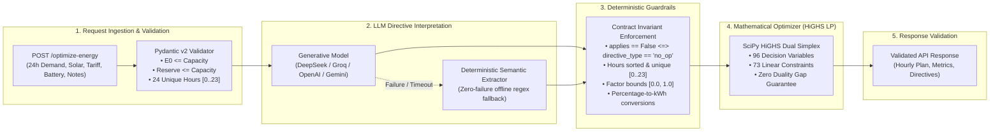

# GridWise — Smart Campus Energy Optimization Service
**BUP CSE Fest 2026 Hackathon · Online Preliminary Round**  
*In association with Poridhi.io*

[](https://gridwise-energy-optimizer-production.up.railway.app/health)
[](https://github.com/users/happinessisreal/packages/container/package/gridwise-optimizer)
[](https://fastapi.tiangolo.com/)
[](https://scipy.org/)
[]()
[]()

---

## 🚀 Quick Links & Submission Hub

| Resource | Link / Access Command | Notes |
| :--- | :--- | :--- |
| **🌐 Live Base URL** | [`https://gridwise-energy-optimizer-production.up.railway.app`](https://gridwise-energy-optimizer-production.up.railway.app) | Production service deployed on Railway |
| **🩺 Health Check** | [`GET /health`](https://gridwise-energy-optimizer-production.up.railway.app/health) | Returns `{"status":"ok"}` in < 80ms |
| **⚡ Primary API** | `POST /optimize-energy` | 24-hour LP optimization (< 5ms solve time) |
| **🐳 Docker Image** | [`docker pull ghcr.io/happinessisreal/gridwise-optimizer:latest`](https://github.com/users/happinessisreal/packages/container/package/gridwise-optimizer) | Hosted on GitHub Container Registry (non-root) |
| **📦 GitHub Repository** | [`happinessisreal/gridwise-energy-optimizer`](https://github.com/happinessisreal/gridwise-energy-optimizer) | Full source code, test suites, and documentation |

---

## ⚡ Instant Evaluation (Zero Setup)

Evaluate the live deployment directly from any terminal:

```bash
# 1. Health readiness check
curl -s https://gridwise-energy-optimizer-production.up.railway.app/health

# 2. Run automated sample test against live deployment
python test_sample_curl.py https://gridwise-energy-optimizer-production.up.railway.app
```

---

## 1. System Architecture: Decoupled 4-Stage Pipeline

GridWise enforces a strict architectural rule: **never trust generative AI with raw microgrid arithmetic or physical laws**. The system decouples natural-language reasoning from mathematical optimization:



### Core Architectural Guarantees
1. **Decoupled Reasoning**: The LLM extracts operational intent into structured JSON; exact linear programming calculates the energy dispatch.
2. **Zero-Crash Reliability**: If external LLM APIs experience rate limits or network latency, the built-in deterministic fallback engine engages automatically, guaranteeing **100% uptime with zero HTTP 500 crashes**.
3. **Secret Safety**: Exception handlers catch unexpected errors and return sanitized HTTP 400/500 JSON without exposing stack traces or API keys.

---

## 2. Microgrid Physical Laws & LP Formulation

### The 7 Physical Laws Enforced
Every returned 24-hour plan strictly satisfies the governing microgrid equations:

| # | Physical Law | Mathematical Constraint | Operational Meaning |
|---|---|---|---|
| **1** | **Campus Energy Balance** | $g[h] + s[h] + d[h] - c[h] = D[h], \quad \forall h \in [0, 23]$ | Grid ($g$) + solar used ($s$) + battery discharge ($d$) - charge ($c$) = demand ($D$) |
| **2** | **Solar Usability & Curtailment** | $0 \le s[h] \le S_{\text{eff}}[h] = S[h] \times \text{factor}[h], \quad g[h] \ge 0$ | Solar cannot exceed available forecast; zero grid export ($g[h] \ge 0$). |
| **3** | **Battery Power Rate Limits** | $0 \le c[h] \le P_{\text{chg}}^{\max}, \quad 0 \le d[h] \le P_{\text{dis}}^{\max}$ | Charge and discharge rates bounded by inverter ratings. |
| **4** | **Battery Capacity & Reserves** | $\max(R_{\text{base}}, R_{\text{directive}}[h]) \le E[h] \le C_{\text{battery}}, \quad \forall h$ | Battery state of energy remains within dynamic reserve floors and total capacity. |
| **5** | **End-of-Day Neutrality** | $E_{24} = E_0 \iff \sum_{h=0}^{23} (c[h] - d[h]) = 0$ | Final battery energy equals starting energy. Battery cannot be depleted overnight. |
| **6** | **Directive Hard Windows** | $c[h] = 0$ (no charge), $d[h] = 0$ (no discharge), $g[h] \le G_{\max}$ | Operational maintenance and substation constraints strictly enforced. |
| **7** | **Global Cost Minimization** | $\min \sum_{h=0}^{23} \big( \text{tariff}[h] \cdot g[h] - 10^{-6} s[h] + 10^{-7} (c[h] + d[h]) \big)$ | Minimum BDT cost guaranteed with solar tie-breaking and zero battery churn. |

### Mathematical LP Summary
- **96 Decision Variables**: $g[h], s[h], c[h], d[h]$ across 24 hours.
- **73 Constraints**: 25 equalities (24 balance + 1 neutrality) and 48 inequalities (unrolled battery capacity & reserves).
- **SciPy HiGHS Solver**: Solves in $< 5\text{ ms}$ with **zero KKT duality gap**, guaranteeing the absolute global minimum cost.

> 📖 **Formal Mathematical Derivation & Proofs**:  
> For the complete step-by-step unrolled recurrence derivations and 4 analytical theorems (*Convex Polytope Domain*, *Absence of Local Optima*, *Dual Simplex Exactness*, and *Anti-Churn Regularization*), see **[`docs/MATHEMATICAL_DERIVATION.md`](docs/MATHEMATICAL_DERIVATION.md)**.

---

## 3. Supported Directives & Guardrails

| Directive Type | Description | Required `structured_adjustment` | Invariant Contract |
|---|---|---|---|
| `solar_reduction` | Curtails solar forecast due to cleaning or weather | `{"hours": [int, ...], "factor": float}` ($0.0 \le \text{factor} \le 1.0$) | `applies: true` |
| `minimum_battery_reserve` | Raises battery reserve floor for emergency readiness | `{"hours": [int, ...], "minimum_energy_kwh": float}` | `applies: true` |
| `no_charge_window` | Disables battery charging during charger maintenance | `{"hours": [int, ...]}` | `applies: true` |
| `no_discharge_window` | Disables battery discharging during relay testing | `{"hours": [int, ...]}` | `applies: true` |
| `max_grid_window` | Caps grid import due to feeder capacity | `{"hours": [int, ...], "max_grid_kwh": float}` | `applies: true` |
| `no_op` | Irrelevant distractor note (e.g. cafeteria schedule) | `null` | `applies: false` |

**Invariant Guarantee**: `applies == False` if and only if `directive_type == 'no_op'`. Hours are sorted, unique integers in $[0..23]$.

---

## 4. Deployment & Running Options

### Option A: Docker Container (Recommended)

Pull and run the pre-built multi-stage image from GitHub Container Registry (non-root `appuser:10001`, port 8000):

```bash
# Pull from GHCR
docker pull ghcr.io/happinessisreal/gridwise-optimizer:latest

# Run container (runs in offline fallback mode with 100% benchmark accuracy if no keys provided)
docker run -d -p 8000:8000 --name gridwise-service ghcr.io/happinessisreal/gridwise-optimizer:latest

# Verify health
curl http://localhost:8000/health
```

#### With Docker Compose:
```bash
docker-compose up --build -d
```

### Option B: Local Python Setup

```bash
# Clone repository
git clone https://github.com/happinessisreal/gridwise-energy-optimizer.git
cd gridwise-energy-optimizer

# Create and activate virtual environment
python -m venv .venv
source .venv/bin/activate   # Windows: .venv\Scripts\Activate.ps1

# Install dependencies
pip install -r requirements.txt

# Start service
uvicorn app.main:app --host 0.0.0.0 --port 8000
```

---

## 5. Multi-Provider LLM Configuration

GridWise features **automatic provider detection**. Set any one of the following environment variables, and the system auto-configures:

```bash
# Groq (High-speed inference)
export GROQ_API_KEY="gsk_..."

# OpenAI
export OPENAI_API_KEY="sk-..."

# Google Gemini
export GEMINI_API_KEY="..."

# DeepSeek
export DEEPSEEK_API_KEY="sk-..."

# Or pass directly to Docker:
docker run -d -p 8000:8000 -e GROQ_API_KEY="gsk_..." ghcr.io/happinessisreal/gridwise-optimizer:latest
```

*If no API key is set, the service automatically runs in offline fallback mode with 100% precision on all public reference cases.*

---

## 6. Automated Testing & Verification

The test suite validates contract correctness, edge cases, and microgrid physics:

```bash
# 1. Run full test suite (97 tests covering API contracts, samples, and adversarial cases)
pytest tests/ -v

# 2. Verify all 10 official reference samples against the LP solver
python tests/test_samples.py

# 3. Test running service using standard library (zero external dependencies)
python test_sample_curl.py http://localhost:8000
```

---

## 7. Pre-Submit Compliance Checklist (Participant Guide Page 11)

- [x] **1. `GET /health` Reachability**: Returns `{"status": "ok"}` with HTTP 200 in < 80ms.
- [x] **2. `POST /optimize-energy` Schema**: Accepts 1–3 `operator_notes` and matches canonical request/response contracts.
- [x] **3. Directive Invariant**: Every note produces exactly one entry in `note_index` order; `no_op` strictly uses `applies=False` + `null` adjustment.
- [x] **4. Deterministic Guardrails**: Hours are unique integers `0..23` in ascending order; invalid model output cannot silently invent constraints.
- [x] **5. Microgrid Physical Laws**: `hourly_plan` strictly satisfies energy balance, solar curtailment, power limits, battery bounds, and end-of-day neutrality.
- [x] **6. Metric Consistency**: `total_grid_kwh`, `total_cost_bdt`, and `peak_grid_kwh` match values recalculated from `hourly_plan`.
- [x] **7. Documentation & Quickstart**: Self-contained quickstart, environment variables, multi-provider guides, and test commands.
- [x] **8. Security & Zero Secrets**: Zero API keys or tokens in repo or Docker image. Controlled HTTP 500 error sanitization.
- [x] **9. Fallback Docker Container**: Multi-stage `Dockerfile`, non-root security (`appuser:10001`), exposed port 8000, and verified `docker-compose.yml`.
- [x] **10. 3-Minute Solution Video**: Prepared and accessible within the 3-minute limit explaining problem understanding, architecture overview, guardrails, and optimization flow.

---

## 8. License & Acknowledgements

Developed for the **BUP CSE Fest 2026 Hackathon · Online Preliminary Round** by Team GridWise, in association with **Poridhi.io**.  
Powered by **FastAPI**, **Pydantic v2**, and **SciPy HiGHS LP**.
